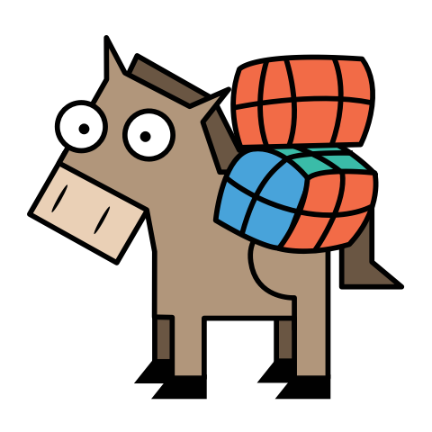

# Workhorse Persistence for Redis

> Redis Workhorse-Persistence Implementation

## Table of Contents

- [Prerequisites](#prerequisites)
- [Install](#install)
- [Getting started](#getting-started)
- [Maintainers](#maintainers)
- [Changelog](#changelog)
- [Contribute](#contribute)
- [License](#license)
  

## Prerequisites

Before you begin, ensure you have met the following requirements:
* You have installed at least [Java 8](http://www.oracle.com/technetwork/java/javase/downloads/jdk8-downloads-2133151.html)
* You have [Maven](https://maven.apache.org/download.cgi) running on your system
  

## Install

TODO

## Getting started

TODO

## Changelog

All release changes can be viewed on our [changelog](./CHANGELOG.md).

## Maintainers

[coodoo](https://github.com/orgs/coodoo-io/people)

## Contribute

Pull requests and issues are welcome.

## License

[Apache-2.0 © coodoo GmbH](./LICENSE)

Logo: [Martin Bérubé](http://www.how-to-draw-funny-cartoons.com)
  